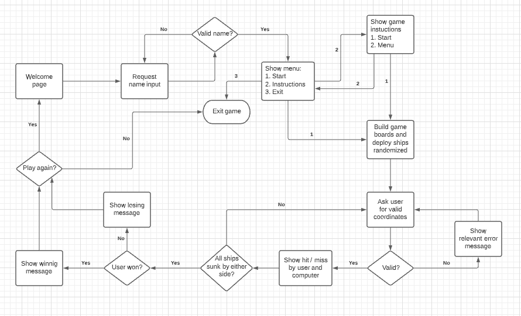
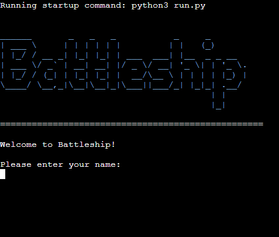
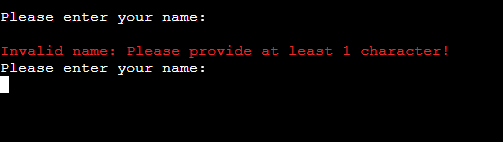
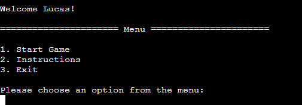
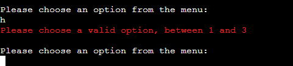
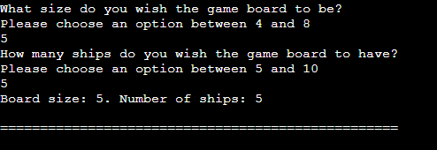
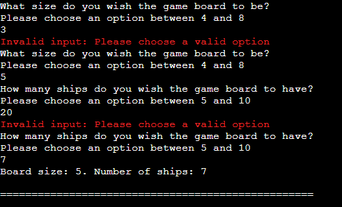
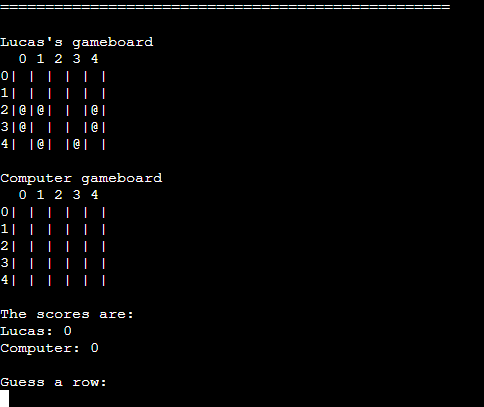

# Battleship

Battleship is a Python terminal game based on the classic with the same name. It is a turn-based guessing game where you play against the computer and try to sink your enemys battleships before your own fleet is destroyed. The user can choose both the grid size and the number of ships to be deployed on each board.

By developing the game on Code Institutes Python Template it can be run in a web browser, as opposed to only being able to run on a CLI or Command Line Interface.

[Find the live website here!](https://battleship-pp3.herokuapp.com/)

## How To Play

Battleship is a board game where the objective is to sink all your opponents ships before your own ships are destroyed. This version of the game lets the user first enter a name and then gets taken to the main menu, where they can choose to jump straight into the game, read instructions on how to play or exit the game. When starting a new game the user chooses a board size between 4x4 and 8x8 to play against the computer on. The user is also asked to input how many ships are to be deployed, between 5 and 10 on each board. With the parameters set, the boards are created and populated with randomly placed ships. The user and computer then take turns guessing coordinates to try and hit each others ships. The users ships are marked with '@' while the computers ships are hidden. A hit on an enemy ship is marked with 'X' and a miss is marked with '-'. The first to sink all enemy ships is the winner!

To read more about the game rules, please visit this [Wikipedia page](https://en.wikipedia.org/wiki/Battleship_(game)).

## User Experience (UX) 
### Site Owner Goals

- Develop a fun and well functioning mini game in a CLI environment.

- Provide a simple and intuitive navigation throughout the game and give the user a positive overall impression.

- Give the user the choise to modify the game board and number of ships, to keep the user engaged over more than a single round.

- Write clean and readable code on which the game runs, and make sure the game doesn't break on any user inputs. 

### User Goals

- Understand the purpose and navigation of the game instantly.

- Play a fun and simple game against the computer.

- View game rules and understand the logic of the game easily.

- See the current score in mid game and view the game boards after each turn.

- Change parameters of the game to play multiple times and have different experiences.

### Structure

The structure of the game is kept simple and intuitive to make sure the user can easily navigate the game and have a positive experience. The main menu works as a hub from where the user can access the different points of the game, and when a game is finished the user is taken back to the menu. By keeping the structure simple and not too clutty, there is a pleasing flow to the game. If desired, a round of Battleship can be played in just a few minutes to reach as wide an audience as possible.

### Design

As the game is developed for a CLI environment there is no traditional design features present, aside from the text being coloured to fit some particular messages. For example, all error messages are red, and some ASCII art are coloured blue.

## Flowchart

The flowchart was created using [Lucidchart](https://www.lucidchart.com/pages/).

Flowchart

## Features

In the following section I will provide an overview of the features included in Battleship. The game is built on the Code Institute Python Template, which provides the HTML and CSS code necessary to play the game in a browser. As that code is not written by the developer, its features will not be mentioned.

### Welcome Page

- The welcome page consists of the name of the game 'Battleship' presented as ASCII art and a small welcome message. 

- The user is then prompted to enter a name, which is validated to be at least one character. If left blank, an error message will print, asking for a valid input.

Welcome Page image

Invalid name image

### Main Menu

- After a valid name is recieved, the main menu is displayed. From here the user can navigate to different points in the game.

- To start the game, the user simply types 1. Instructions on how to play can be found by typing 2. If the user wishes to exit the game, they type 3.

- If an invalid input is recieved, an error message with instructions on valid inputs is printed.

Main Menu image

Main Menu image - invalid input

### Game Parameters

- When starting a new game, the user is asked to choose the game board size and number of ships to be deployed.

- If the user inputs invalid parameters a relevant error message will be displayed that lets the user type a valid option.

- When the choises are made, the board size and number of ships are printed out and the game begins.

Game Parameters image

Game Parameters image - invalid input

### Game Boards

- When parameters are set, the game boards are printed out and populated with the specified number of ships.

- The ships are randomly assigned to both boards and are checked to make sure they don't overlapp.

- Numbers are printed along the rows and columns to help the user easier find the coordinates.

- The ships are marked as '@' on the users board and, for obvious reasons, they are hidden on the computers board.

- Beneath both boards, the current score is displayed.

Game Boards image

### Features Left to Implement

## Testing
### Validator Testing
### Responsive Testing
### Lighthouse Testing
### Links and Form Testing
### Fixed Bugs
### Known/Unfixed Bugs

## Technologies Used
### Languages
### Programs & Libraries

## Deployment

## Credits
### Code
### Content
### Media
### Acknowledgements
