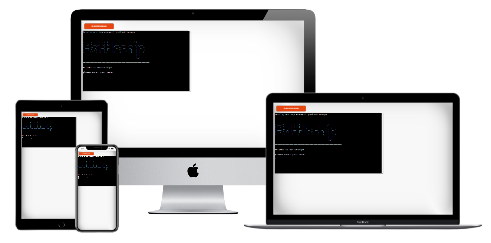

# Battleship

Battleship is a Python terminal game based on the classic with the same name. It is a turn-based guessing game where you play against the computer and try to sink your enemys battleships before your own fleet is destroyed. The user can choose both the grid size and the number of ships to be deployed on each board.

By developing the game on Code Institutes Python Template it can be run in a web browser, as opposed to only being able to run on a CLI or Command Line Interface.

[Find the live website here!](https://battleship-pp3.herokuapp.com/)

## How to Play

Battleship is a board game where the objective is to sink all your opponents ships before your own ships are destroyed. This version of the game lets the user first enter a name and then gets taken to the main menu, where they can choose to jump straight into the game, read instructions on how to play or exit the game. When starting a new game the user chooses a board size between 4x4 and 8x8 to play against the computer on. The user is also asked to input how many ships are to be deployed, between 5 and 10 on each board. With the parameters set, the boards are created and populated with randomly placed ships. The user and computer then take turns guessing coordinates to try and hit each others ships. The users ships are marked with '@' while the computers ships are hidden. A hit on an enemy ship is marked with 'X' and a miss is marked with '-'. The first to sink all enemy ships is the winner!

To read more about the game rules, please visit this [Wikipedia page.](https://en.wikipedia.org/wiki/Battleship_(game))

## User Experience (UX) 
### Site Owner Goals

- 

### User Stories
-	#### First Time User
-	#### Returning User
-	#### Frequent User
### Structure
### Design
-	#### Colours
-	#### Typography
-	#### Imagery

## Wireframes

## Features
### Features Left to Implement

## Testing
### Validator Testing
### Responsive Testing
### Lighthouse Testing
### Links and Form Testing
### Fixed Bugs
### Known/Unfixed Bugs

## Technologies Used
### Languages
### Programs & Libraries

## Deployment

## Credits
### Code
### Content
### Media
### Acknowledgements
