# Battleship

Battleship is a Python terminal game based on the classic with the same name. It is a turn-based guessing game where you play against the computer and try to sink your enemys battleships before your own fleet is destroyed. The user can choose both the grid size and the number of ships to be deployed on each board.

By developing the game on Code Institutes Python Template it can be run in a web browser, as opposed to only being able to run on a CLI or Command Line Interface.

[Find the live website here!](https://battleship-pp3.herokuapp.com/)

## How To Play

Battleship is a board game where the objective is to sink all your opponents ships before your own ships are destroyed. This version of the game lets the user first enter a name and then gets taken to the main menu, where they can choose to jump straight into the game, read instructions on how to play or exit the game. When starting a new game the user chooses a board size between 4x4 and 8x8 to play against the computer on. The user is also asked to input how many ships are to be deployed, between 5 and 10 on each board. With the parameters set, the boards are created and populated with randomly placed ships. The user and computer then take turns guessing coordinates to try and hit each others ships. The users ships are marked with '@' while the computers ships are hidden. A hit on an enemy ship is marked with 'X' and a miss is marked with '-'. The first to sink all enemy ships is the winner!

To read more about the game rules, please visit this [Wikipedia page](https://en.wikipedia.org/wiki/Battleship_(game)).

## User Experience (UX) 
### Site Owner Goals

- Develop a fun and well functioning mini game in a CLI environment.

- Provide a simple and intuitive navigation throughout the game and give the user a positive overall impression.

- Give the user the choise to modify the game board and number of ships, to keep the user engaged over more than a single round.

- Write clean and readable code on which the game runs, and make sure the game doesn't break on any user inputs. 

### User Goals

- Understand the purpose and navigation of the game instantly.

- Play a fun and simple game against the computer.

- View game rules and understand the logic of the game easily.

- See the current score in mid game and view the game boards after each turn.

- Change parameters of the game to play multiple times and have different experiences.

### Structure

The structure of the game is kept simple and intuitive to make sure the user can easily navigate the game and have a positive experience. The main menu works as a hub from where the user can access the different points of the game, and when a game is finished the user is taken back to the menu. By keeping the structure simple and not too clutty, there is a pleasing flow to the game. If desired, a round of Battleship can be played in just a few minutes to reach as wide an audience as possible.

### Design

As the game is developed for a CLI environment there is no traditional design features present, aside from the text being coloured to fit some particular messages. For example, all error messages are red, and some ASCII art are coloured blue.

## Flowchart

The flowchart was created using [Lucidchart](https://www.lucidchart.com/pages/).

Flowchart

## Features

In the following section I will provide an overview of the features included in Battleship. The game is built on the Code Institute Python Template, which provides the HTML and CSS code necessary to play the game in a browser. As that code is not written by the developer, its features will not be mentioned.

### Welcome Page

- The welcome page consists of the name of the game 'Battleship' presented as ASCII art and a small welcome message. 

- The user is then prompted to enter a name, which is validated to be at least one character. If left blank, an error message will print, asking for a valid input.

Welcome Page image

Invalid name image

### Main Menu

- After a valid name is recieved, the main menu is displayed. From here the user can navigate to different points in the game.

- To start the game, the user simply types 1. Instructions on how to play can be found by typing 2. If the user wishes to exit the game, they type 3.

- If an invalid input is recieved, an error message with instructions on valid inputs is printed.

Main Menu image

Main Menu image - invalid input

### Game Parameters

- When starting a new game, the user is asked to choose the game board size and number of ships to be deployed.

- If the user inputs invalid parameters a relevant error message will be displayed that lets the user type a valid option.

- When the choises are made, the board size and number of ships are printed out and the game begins.

Game Parameters image

Game Parameters image - invalid input

### Game Boards

- When parameters are set, the game boards are printed out and populated with the specified number of ships.

- The ships are randomly assigned to both boards and are checked to make sure they don't overlapp.

- Numbers are printed along the rows and columns to help the user easier find the coordinates.

- The ships are marked as '@' on the users board and, for obvious reasons, they are hidden on the computers board.

- Beneath both boards, the current score is displayed.

Game Boards image

### Playing The Game

- After the boards and scores are printed, the user is prompted to make a guess where an enemy ship might be. First they input a row number, followed by a column number.

- If the user input doesn't match the expected input an error message is displayed, with the relevant information. If a user tries to guess coodinates already guessed, a message informing them of this will be displayed.

- The computer then generates a random guess and tries its luck before the results are shown and the next turn begins.

- A short message declaring a hit or miss by either side is displayed before the updated game boards and scores are printed again.

- If a hit is made by either side, the enemy board recieves an 'X' to mark a sunken ship. A miss will result in a '-' to mark a previously missed guess.

- As the game progresses the boards will fill with hit and miss symbols until a winner is declared. When all ships on either board are sunk, the game ends and the user is taken back to the main menu, where they can start again with new parameters if they wish.

User Guess image - invalid input

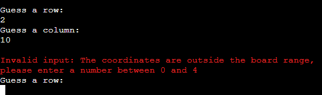
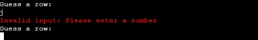
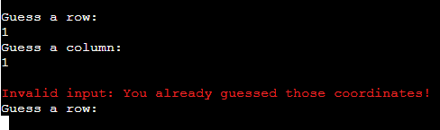

User Guess image - Miss

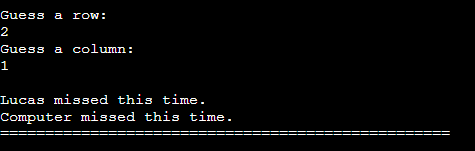

User Guess image - Hit

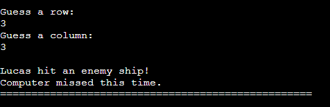

Game Won image

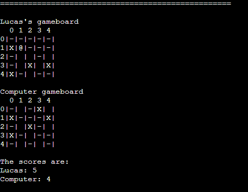
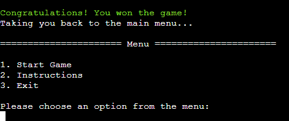

Game Over image

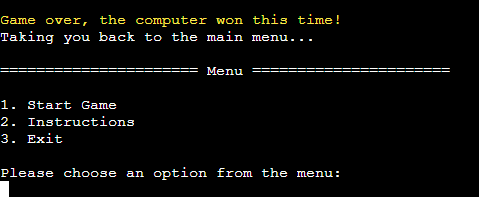

### Instructions Page

- From the main menu, the user can navigate to the instructions page by typing 2. Here the user will learn how the game operates and takes input. 

- When the user is ready they can start a new game straight from this page, or they can choose to go back to the main menu.

- If an invalid input is recieved, an error message with instructions on valid inputs is printed.

Instructions Page image

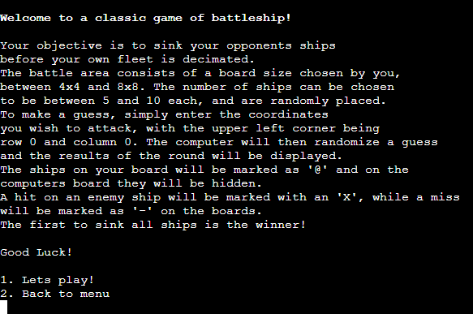

Instructions Page image - invalid input

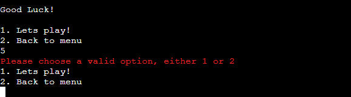

### Exit Page

- When a user chooses to exit the game from the main menu, a small message thanks the user for playing and prints the word 'goodbye' in ASCII art. The user is also informed to press the 'Run Program' button to restart the game.

Exit Page image

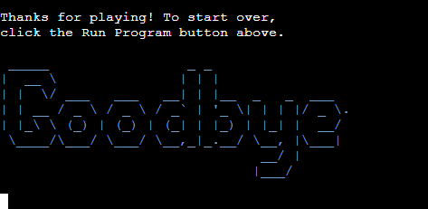

### Future Features

- Ships that takes up more than one grid size, much like the original game.

- Highscore system through a Google Spreadsheet.

- Two-player function to play against another user either locally or online.

- A properly designed UI to add to the experience.

## Data Model

- The game utilizes a GameBoard class to create both boards, in which the input parameters, such as size and number of ships are stored. It also takes in all guesses made on each board, the location of the deployed ships, the name and type of player the board belongs to (user or computer).

- The class then builds the boards with the correct parameters and prints them out. After each turn the boards are updated with the stored guesses and printed out anew.

- Aside from the GameBoard class there are helper functions that are called as the game progresses, such as asking for and validating the coordinates guessed and generating random integers to use when adding the ships.

## Testing
### Validator Testing

- To ensure that the python code is free of errors and written correctly, validation through the PEP8 online validator was performed with no errors or warnings raised.

PEP8 Online Validator

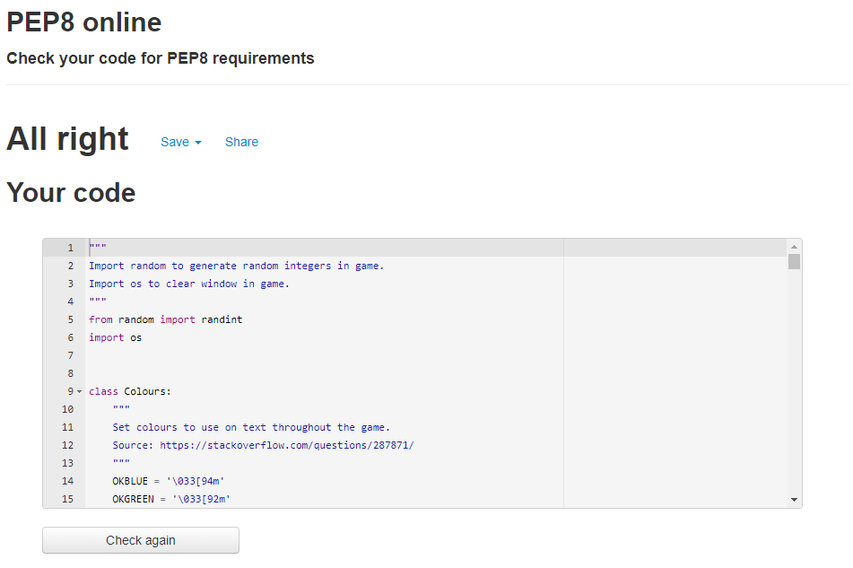

- All HTML and CSS code for this game was taken from the Code Institute Python Template and has not been altered in any way. Therefore any testing on this code will not be performed.

### Lighthouse Testing

- The Lighthouse tool in Chrome DevTools was used to mainly test the games performance and to make sure there were no performance issues when running the game. It performed well in the test, indicating a smoothly running game. 

- The issues raised in the lighthouse test, mainly in accessibility and SEO was due to code in the template, and is not affected by the python code written by the developer.

Lighthouse Report

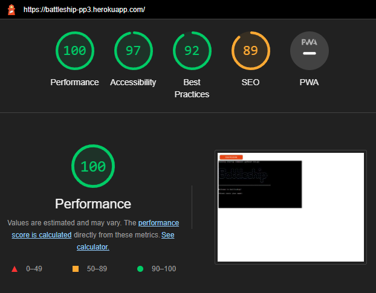

### Manual Testing

- Extensive manual testing was done throughout the developing process, where all user inputs have the desired effect. If a user input is invalid, a relevant error message will tell the user what to input instead.

- All features respond as expected and give the correct error messages when user input is invalid. Messages will be displayed in a red text colour to make sure that the user understands that an input error has occured. To see the different messages, please check the features section.

- The game was also tested to make sure that the different parameters the user can choose will work as expected, so that the game boards will have the desired size and number of ships. The ship placement have been checked to make sure that no overlapping occurs and and all ships are deployed correctly. The computer inputs have been tested to make sure no duplicate guesses or other issues occur that are outside the control of the user. 

- Testing was performed in both the Gitpod terminal and Code Institutes Heroku mock terminal in several different browser, such as Chrome, Edge and Firefox.

### Fixed Bugs

- The game boards initially started the rows and columns count on 1. This created some issues when validating user and computer coordinates. By changing to starting at 0, they match the coordinates created when an input is made, as they start with 0-index.

- There was a validation issue with duplicate guesses. The turn continued instead of asking for a new guess. A solution was found by moving duplicate guess validation from validate_coordinates to make_guess inside the loop, so that if a duplicate guess is made, the user is prompted to make another guess inside the same loop as the user inputs are in.

- User guesses returned a list while computer guesses returned a tuple as expected. An incorrect append to guesses in validate_coordinates was removed, as it was misstakenly placed there, and the append instead happens in the guess function.

- When populating the boards, computer board ships overlapped because of an if statement checking for already added '@'. By changing to check if coordinates are in ships list, the issue was resolved.

- Bad error message when user input was not integer. The ValueError raised was printed incorrectly. By changing the print statements in the error handling, the desired output is now received.

### Known/Unfixed Bugs

- As of writing this readme, no known bugs remain unfixed.

## Technologies Used
### Languages

- [Python](https://www.python.org/)

#### Python Libraries

- [OS](https://docs.python.org/3/library/os.html) - A Python library used for clearing the window at certain points in the game.

- [Random](https://docs.python.org/3/library/random.html) - A Python library used to generate random integers in the game.

### Programs & Libraries

- [Git](https://git-scm.com/) - Git was used through the Gitpod terminal to commit to Git and push to GitHub.

- [GitHub](https://github.com/) - All code for the site is stored on GitHub after being pushed from Git.

- [Heroku](https://www.heroku.com) - Used for hosting the game.

- [Lucidchart](https://www.lucidchart.com/pages/) - The flowchart created for the game was made through Lucidchart.

- [Patorjk ASCII Art Generator](http://patorjk.com/software/taag/#p=display&f=Graffiti&t=Type%20Something%20) - The ASCII art used in the game was generated with this app.

- [PEP8 Online Validator](http://pep8online.com/) - Validation of Python code was done with PEP8 Online.

- [Techsini](http://techsini.com/multi-mockup/index.php) - The responsive image at the top of the README came from Techsini.

## Deployment

## Credits
### Code
### Content
### Media
### Acknowledgements
